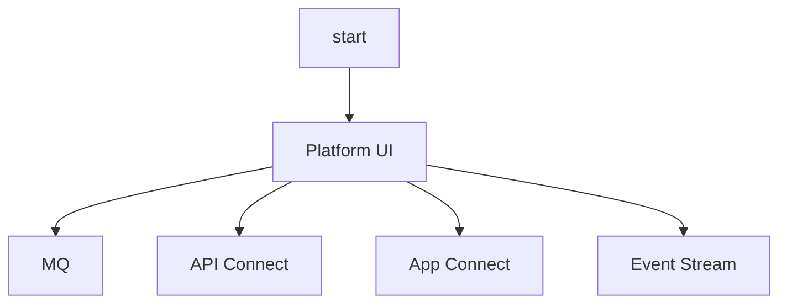

# Techzone Deployer Cloud Pak for Integration pipelines

This repository contains a set of Tekton pipelines to deploy Cloud Pak for Integration into an IBM Technology Zone `deployer` cluster.

## Pre-requisites

An IBM Technology Zone `deployer` cluster is assumed to be configured with an appropriate Red Hat OpenShift version for the Cloud Pak for Integration version you wish to deploy, with appropriate sizing. Refer to [IBM Cloud Pak for Integration documentation](https://www.ibm.com/docs/en/cloud-paks/cp-integration/2022.4) for more information.

A `deployer` cluster is configured with the following items:

- ExternalSecrets operator deployed with a ClusterSecretStore configured. The remote ExternalSecrets secret store must include an IBM Entitlement Key.
- Techzone Deployer Tekton tasks deployed ([deploy YAML](https://github.com/cloud-native-toolkit/deployer-tekton-tasks/blob/main/argocd.yaml)).
- OpenShift GitOps configured with [One Touch Provisioning ArgoCD instance](https://github.com/one-touch-provisioning/otp-gitops), and any relevant RBAC rules.
- OpenShift Pipelines operator deployed.

## Repository organisation

Each top-level folder in this repository represents a Cloud Pak for Integration version. In each top-level folder contains 2 main folders `argocd` and `pipelines`. The `argocd` folder contains ArgoCD applications that can be deployed into an OpenShift cluster configured with OpenShift GitOps (ArgoCD). The `pipelines` folder contains Tekton pipelines and pipelineruns for each integration capabilities.

```
.
└── cp4i-version/
    ├── argocd/
    │   └── deployer.yaml
    └── pipelines/
        └── capability/
            ├── pipeline.yaml
            └── pipelinerun.yaml
```

Additionally, where relevant, a Backstage `catalog-info.yaml` is provided to add metadata.

## Pipelines organisation

Each Cloud Pak for Integration is deployed with its own pipeline. If a capability is dependent on another capability being deployed, e.g.: MQ requires the base Cloud Pak for Integration operator (Platform UI) to be deployed, then the dependent capability will include a wait step to ensure the base operator is deployed before the dependent operator is deployed.



These pipelines are written to be run in parallel with one another.

## Deploy

As each capability's pipeline and pipelinerun is organised into folder, uncomment/comment the `<version>/argocd/deployer.yaml`'s Application sources to select which capabilities to deploy into a cluster. The example below deploys Platform UI, MQ, API Connect and App Connect for Cloud Pak for Integration v2022.4 into a cluster.

```yaml
apiVersion: argoproj.io/v1alpha1
kind: Application
metadata:
  name: deployer-cp4i
  namespace: openshift-gitops
spec:
  project: default
  destination:
    server: https://kubernetes.default.svc
    namespace: default
  sources:
    - repoURL: 'https://github.com/cloud-native-toolkit/deployer-cp4i.git'
      targetRevision: main
      path: 2022.4/pipelines
    - repoURL: 'https://github.com/cloud-native-toolkit/deployer-cp4i.git'
      targetRevision: main
      path: 2022.4/pipelines/mq
    - repoURL: 'https://github.com/cloud-native-toolkit/deployer-cp4i.git'
      targetRevision: main
      path: 2022.4/pipelines/api-connect
    - repoURL: 'https://github.com/cloud-native-toolkit/deployer-cp4i.git'
      targetRevision: main
      path: 2022.4/pipelines/app-connect
  syncPolicy:
    automated:
      prune: false
      selfHeal: true
    syncOptions:
    - CreateNamespace=true
```